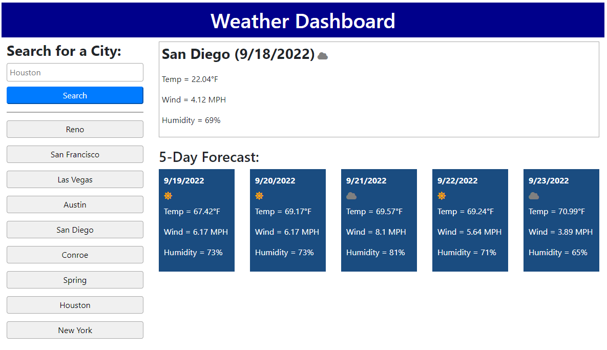

# Weather Dashboard

## Description

As we continue to build on our coding skills, we now incorporate the skill of retrieving data from a server-side API and using that data to fulfil a need for a user. In this project, I used data the [OpenWeather 5 day weather forecast API](https://openweathermap.org/forecast5) to create a weather dashboard which displays key weather details for the current date through 5 days in the future.

## Installation

N/A

## Usage

The deployed application can be found [here](https://amaragh.github.io/weather-dashboard/).

This weather dashboard allows the user to find current weather and 5-day forecast for any city. As the user searches for additional cities, each previously searched city will appear below the input form as a clickable button. As such, weather for a previously searched city is just a button click away and does not have to be typed into the form again.

The below screenshot shows the dashboard with weather for San Diego being displayed after the corresponding historical search button was clicked.

## Credits

N/A

## License

Please refer to the license in the repo.

